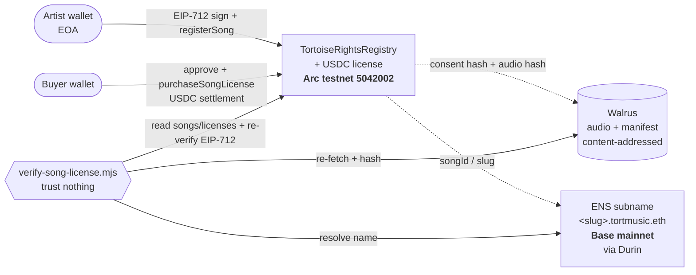

# Tortoise Rights Registry

**Provable AI-training consent for music.** An artist opts a song into AI-training
licensing with an EIP-712 wallet signature; the audio and a consent manifest are
stored on [Walrus](https://walrus.xyz); a minimal contract on **Base** records the
consent hash and sells a **USDC** license for that song; an ENS subname under
`tortmusic.eth` (via [Durin](https://durin.dev)) names it; and a standalone
verification script lets **anyone confirm every claim without trusting Tortoise**.

This is a standalone, open-source companion to [Tortoise Music](https://tortoise.studio).
It reads real Tortoise songs over a public, read-only HTTP seam and requires **zero
changes** to the Tortoise app. It is **consent infrastructure for a prototype** —
not legal advice, and not a promise of artist revenue.

**Live app:** https://tortoise-rights-registry.vercel.app

---

## How it works (end to end)

1. **Opt in.** An artist opens the app for one of their songs (loaded by slug from
   Tortoise's public API, or by pasting an audio URL/CID), connects their wallet, and
   signs the EIP-712 `Consent` message binding *who* consents, to *which audio*
   (by content hash), under *which* license terms.
2. **Store on Walrus.** The server hashes the audio (keccak256), mirrors the audio
   bytes to Walrus, builds the song manifest, and stores it on Walrus too.
3. **Record on Base.** The **artist's own wallet** sends `registerSong` (paying gas),
   committing the manifest hash, audio hash, permission mode, license-terms hash, the
   Walrus blob ids, and the price on-chain. The app holds no private key.
4. **Name in ENS.** In the same opt-in flow, the artist's wallet mints
   `<slug>.tortmusic.eth` (via the registrar's artist-gated `registerByArtist`) with
   text records pointing at the manifest, audio blob, and contract — so the app stays
   keyless. An admin CLI (`pnpm mint:name`) is an alternative.
5. **License.** A model developer approves USDC and calls `purchaseSongLicense`. The
   payment goes directly to the treasury; the buyer's license is recorded on-chain.
6. **Verify.** Anyone runs `node scripts/verify-song-license.mjs <slug>` from a clean
   clone and gets a per-check, all-green (or non-zero-exit) report.

## Architecture

- **`contracts/`** — Foundry. `TortoiseRightsRegistry.sol` (EIP-712 consent + USDC
  licensing) and `TortoiseRegistrar.sol` (a Durin registrar with an `onlyOwner` admin
  mint **plus** an artist-gated `registerByArtist` so the web app mints names keylessly
  — Durin's open-mint example registrar is deliberately *not* used).
- **`src/`** — a Next.js app (artist opt-in + buyer license page) plus a viem-only
  core library (`src/lib/`): `eip712`, `walrus`, `manifest`, `registry`, `ens`,
  `tortoise`. The `/api` routes are **keyless** (hashing + Walrus mirroring only).
- **`scripts/`** — `verify-song-license.mjs` (the centerpiece), `mint-song-name.mjs`
  (admin CLI), and smoke tests for Walrus and ENS.
- **`schemas/`** — JSON Schema for the song and license-receipt manifests.
- **`LICENSE_TERMS.md`** — the license whose keccak256 is the signed `licenseTermsHash`.

No database. Canonical state lives on-chain + Walrus + ENS, which is what makes every
claim independently verifiable.

## Setup

```bash
# 1. JS / app deps
pnpm install

# 2. Foundry deps (pinned; contracts/lib is gitignored)
cd contracts && ./install-deps.sh && forge build && cd ..

# 3. Config — fill in addresses as you deploy. The web app needs NO private key;
#    only the local CLI/deploy scripts read ADMIN_PRIVATE_KEY (from .env or a keystore).
cp .env.example .env

# 4. Smoke-test the Walrus blob store (no wallet needed)
pnpm smoke:walrus

# 5. Contract tests (USDC paths run against a Base mainnet fork)
cd contracts && BASE_RPC_URL=https://mainnet.base.org forge test --fork-url base && cd ..

# 6. App unit tests + dev server
pnpm test
pnpm dev
```

## Full walkthrough (deploy → opt-in → name → license → verify)

Requires a funded admin wallet on Base, and an artist + buyer wallet. See
`plans/PREREQUISITES.md` for the one-time on-chain setup (Durin L2Registry, the two L1
resolver txs, funding). Walrus uses testnet (free) — see the note below.

```bash
# A. Deploy the registry to Base (constructor: USDC + treasury). Anvil-fork dry-run first.
cd contracts
ln -sf ../.env .env                              # forge reads env from contracts/, not the repo root (gitignored)
cast wallet import tortoise-admin --interactive  # one-time: encrypt the admin key (keeps it out of shell history)
forge script script/Deploy.s.sol --rpc-url base --broadcast --verify \
  --account tortoise-admin --sender <ADMIN_ADDR>   # --broadcast alone will NOT sign — pass a signer
#  → record the address into .env as RIGHTS_REGISTRY_ADDRESS *and* NEXT_PUBLIC_RIGHTS_REGISTRY_ADDRESS
#    (same value — the browser only reads NEXT_PUBLIC_*), and into Vercel env.
#  ⚠️ Deploy BEFORE collecting any opt-in signature — the EIP-712 domain binds this
#     address; a redeploy invalidates every signature already collected.

# B. Deploy the onlyOwner registrar, then authorize it on the L2Registry.
forge script script/DeployRegistrar.s.sol --rpc-url base --broadcast --verify \
  --account tortoise-admin --sender <ADMIN_ADDR>
#  → then: cast send <L2Registry> "addRegistrar(address)" <registrar> --rpc-url base --account tortoise-admin ; cd ..

# C. Opt a song in — from the live app (or pnpm dev): open /song/<slug>, connect the
#    artist wallet, sign the consent, send registerSong, then registerByArtist (the
#    artist pays gas for both). Audio + manifest go to Walrus; consent lands on Base;
#    AND <slug>.tortmusic.eth is minted in the same flow.

# D. (Optional) If the in-flow name mint was skipped/failed, an admin can mint it via CLI:
pnpm mint:name <slug>        # alternative to the in-flow registerByArtist

# E. License it — a buyer opens /song/<slug>, approves USDC, and buys (two steps).

# F. Verify everything, trusting nothing:
pnpm verify <slug>                       # song artifact + consent + availability
pnpm verify <slug> --buyer <address>     # also that buyer's on-chain license
pnpm verify <slug> --rpc-fallback        # read ENS direct from the L2Registry
```

`verify-song-license.mjs` resolves the song's ENS name, fetches the manifest + audio
from Walrus and checks their hashes against the contract, re-derives and verifies the
artist's EIP-712 consent (ERC-1271-aware), confirms `licenseTermsHash ==
keccak256(LICENSE_TERMS.md)` and that the manifest price matches on-chain, and reports
`licenseActive`. It prints a per-check result and exits non-zero on any mismatch.

## Deployed addresses (Base mainnet, chainId 8453)

| What | Address |
| ---- | ------- |
| USDC (Circle) | `0x833589fCD6eDb6E08f4c7C32D4f71b54bdA02913` |
| Durin L2RegistryFactory | `0xDddddDdDDD8Aa1f237b4fa0669cb46892346d22d` |
| Durin L1 Resolver (Ethereum mainnet) | `0x8A968aB9eb8C084FBC44c531058Fc9ef945c3D61` |
| `TortoiseRightsRegistry` | [`0xA0bd2b9f2d9554cA3AAeD618E420Aac816d80bbe`](https://basescan.org/address/0xA0bd2b9f2d9554cA3AAeD618E420Aac816d80bbe) |
| `TortoiseRegistrar` (artist-gated mint) | [`0x7640eB413A5AD4aa1D28485db09a658629e30601`](https://basescan.org/address/0x7640eB413A5AD4aa1D28485db09a658629e30601) |
| `tortmusic.eth` L2Registry (Durin) | [`0x8aB7bB948298826D7495656290dFD241a544A680`](https://basescan.org/address/0x8aB7bB948298826D7495656290dFD241a544A680) |

Live example: [`licensetest5.tortmusic.eth`](https://tortoise-rights-registry.vercel.app/song/licensetest5) — opted in, named, and licensed; verify it with `node scripts/verify-song-license.mjs licensetest5`.

## A note on Walrus (testnet blobs)

Walrus has **no free first-party publisher on mainnet** (by design), so blobs (audio +
manifests) are stored on the free, open **Walrus testnet** publisher while the contract,
USDC, and ENS all run on **mainnet**. A `blobId` is a deterministic content hash, so
integrity is provable regardless of which Walrus network holds the bytes. Endpoints are
env-driven (`WALRUS_PUBLISHER` / `WALRUS_AGGREGATOR`), so swapping to a self-run mainnet
publisher later is a config change. See `plans/PREREQUISITES.md`.

**Durability is finite.** Testnet blobs are deleted once `WALRUS_EPOCHS` elapse (and testnet is
periodically reset), so the bytes — and therefore `verify-song-license.mjs`'s audio + manifest
checks — stay available only for a window (~weeks at `WALRUS_EPOCHS=53`). The on-chain consent,
licenses, and committed hashes are permanent; because a `blobId` is a content hash, re-pinning the
*same* bytes to any Walrus network restores full verification unchanged. For a durable deployment,
run an authed mainnet publisher (`WALRUS_PUBLISHER` + `WALRUS_PUBLISHER_AUTH`).

## Arc settlement (Circle Continuity Track)

The license purchase is already a USDC payment, so the registry + payment can run on **[Arc](https://arc.network)** — Circle's USDC-native L1, where USDC *is* the gas token — as the settlement layer, while keeping ENS on Base (Durin's CCIP-Read can't prove a non-rollup L1) and Walrus unchanged. The whole thing is a one-flag switch (`REGISTRY_CHAIN_ID`); the Base mainnet deployment is untouched and stays the default.



No transactional bridge: the two chains are tied only by the shared `songId` (slug) and the content hashes committed on-chain. ENS minting stays in the admin CLI (`mint-song-name.mjs`) so the demo flow never switches networks mid-action.

**Deployed + verified on Arc testnet (chainId 5042002):**

| What | Address / proof |
| ---- | --------------- |
| USDC (Arc system ERC-20, `decimals()=6`) | `0x3600000000000000000000000000000000000000` |
| `TortoiseRightsRegistry` (verified on ArcScan) | [`0xF128B0106f0495dE5407a3E46044fb6b8478F4Ba`](https://testnet.arcscan.app/address/0xF128B0106f0495dE5407a3E46044fb6b8478F4Ba#code) |
| opt-in (`registerSong`) | [`0xb1e05804…f0df4`](https://testnet.arcscan.app/tx/0xb1e05804039d4f1d517a11131a3a80afa9364610c18ffcbba076730f7a6f0df4) |
| license (`purchaseSongLicense`, USDC settlement) | [`0x72f5341e…cf10e4`](https://testnet.arcscan.app/tx/0x72f5341e193f373dfc93e4c9a12482316eccdefe57146f4a950931e285cf10e4) |

`node scripts/verify-song-license.mjs licensetest5 --song-id licensetest5 --buyer <addr>` → **ALL CHECKS PASSED** with the registry + EIP-712 read from Arc and ENS from Base.

**Run it on Arc:** set `REGISTRY_CHAIN_ID=5042002` (+ the `NEXT_PUBLIC_` twin) and the `ARC_*` vars in `.env` (see `.env.example`), deploy with `forge script script/DeployArc.s.sol --rpc-url arc --broadcast --account tortoise-admin --sender <ADMIN>`, then opt in + license as usual. Fund wallets from [faucet.circle.com](https://faucet.circle.com) (USDC is gas on Arc). `pnpm smoke:arc` is the go/no-go gate. Flip back to Base by unsetting `REGISTRY_CHAIN_ID` — no other edits.

> Trade-off, stated plainly: Arc has **no mainnet yet** (≈2026), so adopting it moves the consent record *and* the payment to testnet. The real-USDC **Base mainnet** deployment above remains the production leg; Arc is the purpose-built settlement chain for when it ships mainnet.

## Honest framing

- **Consent, not provenance.** The signature proves *a named wallet consented to this
  audio hash under these terms*. The wallet↔song-ownership link is attested by Tortoise
  (the song's public `walletAddress`), not cryptographically proven.
- **No revenue promise.** USDC payments go to the treasury. This is a prototype.
- **Single song (MVP).** Bundling many songs into curated training *packages* is the
  explicit next step, not part of this build.

## License

MIT (code) — see `LICENSE`. The AI-training license terms are in `LICENSE_TERMS.md`.
